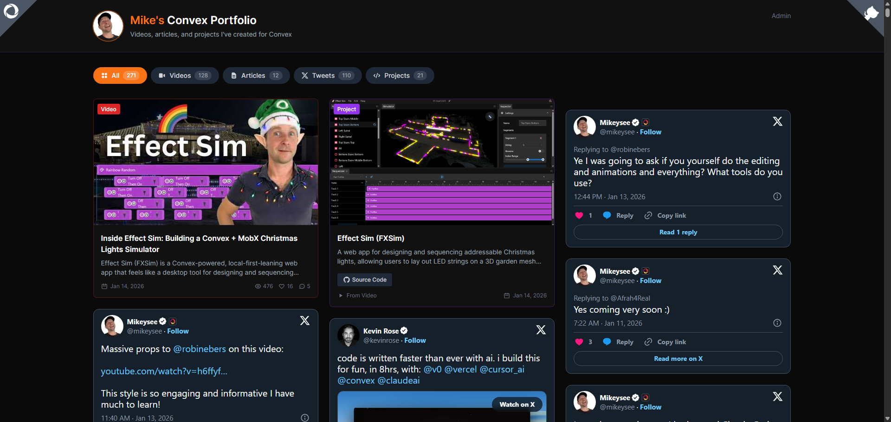

# Mike's Convex Portfolio

A content aggregation app that showcases all the content I've created for [Convex](https://convex.dev) - videos, articles, and projects - all in one place.

**This entire app was built using [Claude Code](https://claude.ai/code) without opening an IDE once.**

## What It Does

- **YouTube Integration**: Fetches and displays videos from a YouTube channel via the Data API v3
- **Stack Articles**: Scrapes articles from [stack.convex.dev](https://stack.convex.dev) for a specific author
- **AI Project Extraction**: Uses Claude to automatically parse video/article descriptions and extract GitHub repos and demo links into project entries
- **Convex Code Contributions**: Fetches public commits authored by Mike in the open source Convex backend repo
- **Admin Dashboard**: Authenticated backend for content moderation (marking videos as mine/not mine, hiding projects)
- **Automated Refresh**: Hourly cron jobs keep content up to date

## Tech Stack

- **Frontend**: React + Vite + Tailwind CSS
- **Backend**: [Convex](https://convex.dev) (real-time database, serverless functions, cron jobs)
- **AI**: Anthropic Claude API for intelligent project extraction
- **Auth**: Simple session-based authentication

## The Claude Code Experiment

This project was an experiment in "vibe coding" - building an entire app purely through conversational AI without traditional IDE usage. Some highlights from the experience:

### What Worked Well

- **Plugins**: Easy to install MCP servers, skills, and tools (like [dev-browser](https://github.com/SawyerHood/dev-browser) for screenshots)
- **Plan Mode**: Claude intelligently enters planning mode for complex tasks, asking clarifying questions before diving in
- **Agentic Intelligence**: The agent used the right tools at the right time - including the Convex CLI for calling internal mutations

### Lessons Learned

- Terminal UIs have discoverability challenges compared to graphical IDEs
- Model switching mid-prompt can be tricky
- Token costs add up quickly with Opus 4.5 (~$60 for this project)

## Getting Started

### Prerequisites

- [Bun](https://bun.sh) (or npm/yarn)
- A [Convex](https://convex.dev) account
- YouTube Data API key
- Anthropic API key (for project extraction)

### Installation

1. Clone the repository
2. Install dependencies:

   ```bash
   bun install
   ```

3. Set up environment variables (see `.env.local.example`):
   - `VITE_CONVEX_URL` - Your Convex deployment URL
   - `YOUTUBE_API_KEY` - YouTube Data API v3 key (set in Convex dashboard)
   - `YOUTUBE_CHANNEL_ID` - Target YouTube channel ID
   - `STACK_AUTHOR_SLUG` - Author slug for stack.convex.dev
   - `ANTHROPIC_API_KEY` - For AI-powered project extraction
   - `GITHUB_TOKEN` - Optional token for GitHub API rate limits when fetching public Convex backend commits

4. Start the development servers:
   ```bash
   bun run dev
   ```

This runs both Vite (frontend on port 5173) and Convex (backend) concurrently.

## Project Structure

```
├── src/
│   ├── components/     # React components (ContentCard, FilterBar, etc.)
│   ├── pages/          # Home and Admin pages
│   ├── hooks/          # Custom React hooks
│   └── main.tsx        # App entry with providers
├── convex/
│   ├── model/          # Data layer (videos, articles, projects)
│   ├── lib/            # Utilities (project extraction, normalization)
│   ├── __tests__/      # Vitest tests for Convex functions
│   ├── youtube.ts      # YouTube API integration
│   ├── stack.ts        # Stack article scraping
│   ├── admin.ts        # Admin mutations (protected)
│   ├── crons.ts        # Scheduled refresh jobs
│   └── schema.ts       # Database schema
```

## Available Scripts

```bash
bun run dev          # Start frontend + backend dev servers
bun run build        # Type check and build for production
bun run typecheck    # TypeScript type checking only
bun run lint         # Run ESLint
bun test             # Run tests (watch mode)
bun test --run       # Run tests once
```

## How It Works

1. **Content Fetching**: Cron jobs trigger `youtube:refresh` and `stack:refresh` hourly
2. **Video Moderation**: New videos start as "undecided" - admin marks them as "mine" or "notMine"
3. **Project Extraction**: When content is marked as "mine", Claude analyzes the description to extract GitHub/demo links
4. **Code Contributions**: A daily GitHub refresh stores public Convex backend commits authored by Mike
5. **Public Display**: Only "mine" videos and all articles are shown publicly, with their extracted projects and code contributions

## License

MIT
